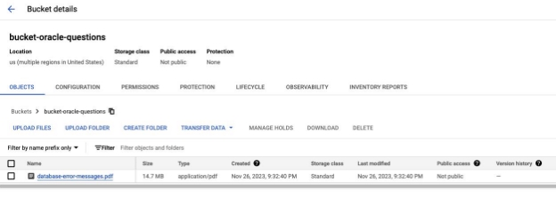

AI Hackathon (25th Nov)

- **Problem**: “Analyze Support Cases”
- **Use Case:** In summary, it suggests solutions for Oracle Database (19c version) issues based on the known issues is a smart strategy to optimize technical support, improve team efficiency, and provide a more satisfactory customer experience.

Members

- [Lineu Filho](mailto:lineu.filho@avenuecode.com)
- [Luiz Consani](mailto:luiz.consani@avenuecode.com)

Solution

We used a Search and Conversation application to create the chat in which users could search for their various questions regarding problems using the Oracle database. The application was trained using a bucket that contains a file with the mapping of problems and solutions. After training, we created a chatbot-linked page with the application where we can ask different questions and obtain accurate answers according to what was trained, as shown in the images below.

Technologies

- GCP
- Vertex AI
- Cloud Storage
- Search and Conversation Application

Dataset Used

Used known issues for Oracle Database [https://docs.oracle.com/en/database/oracle/oracle-database/19/errmg/database-error-messages .pdf](https://docs.oracle.com/en/database/oracle/oracle-database/19/errmg/database-error-messages.pdf)

How it Works

- Access Website
- Click in the Help icon below:

- Then Support team can describe the issue reported related to “Oracle Database 19c”:

○ Ex 1: User described a scenario or issue without error code

- Ex 2: User reported specific error message
- 
