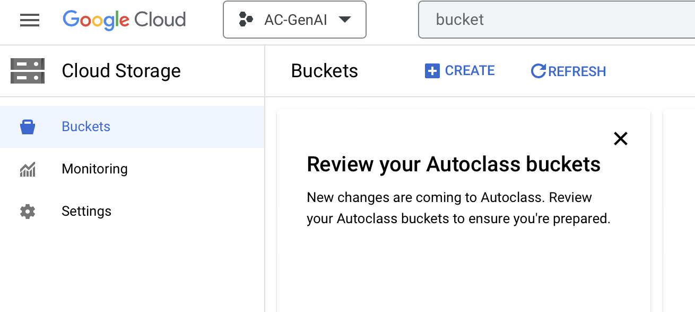
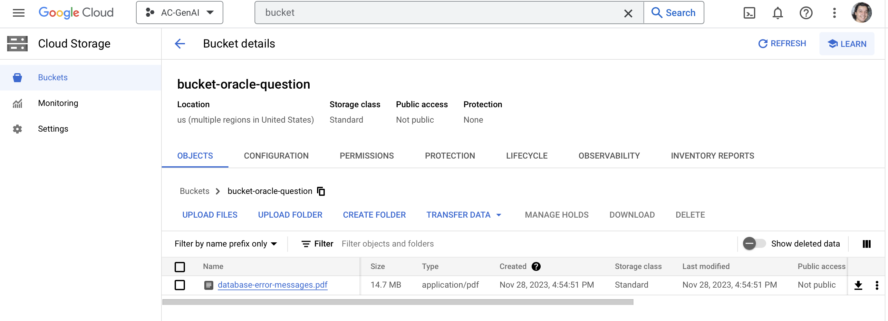
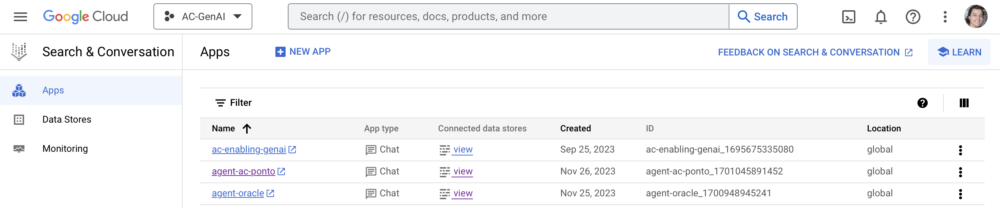
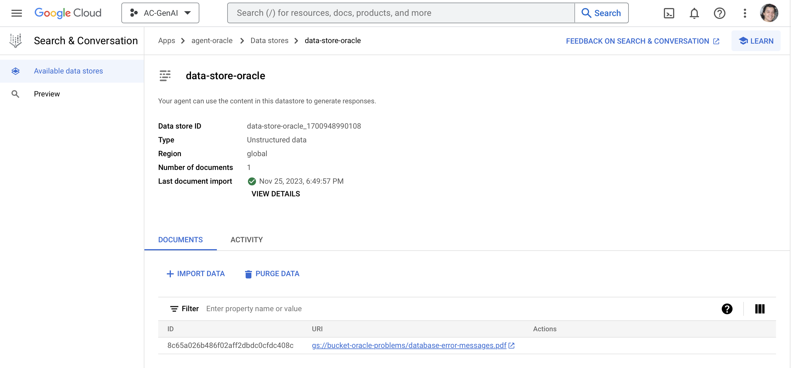
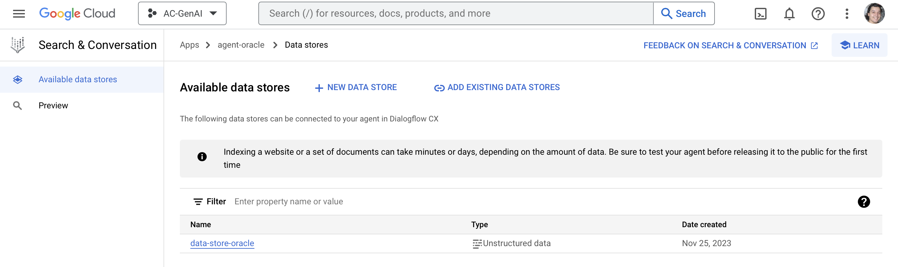
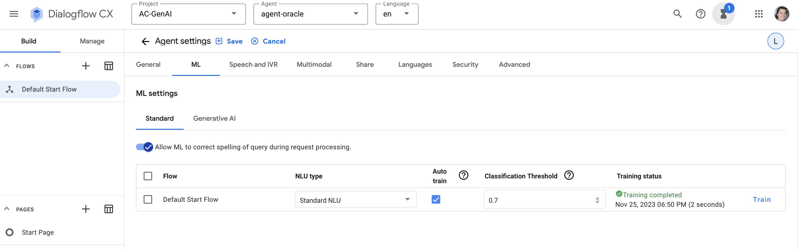
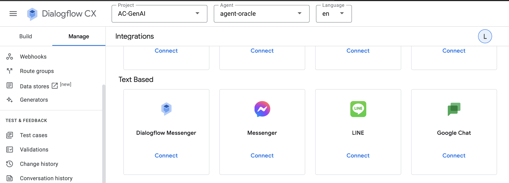
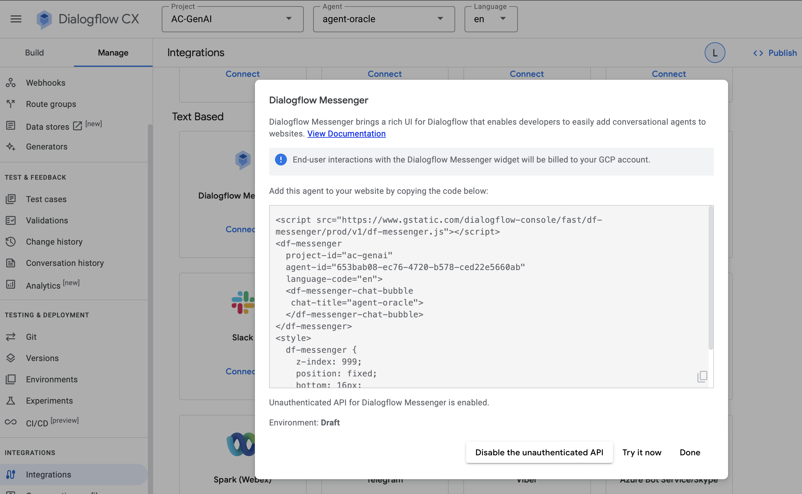
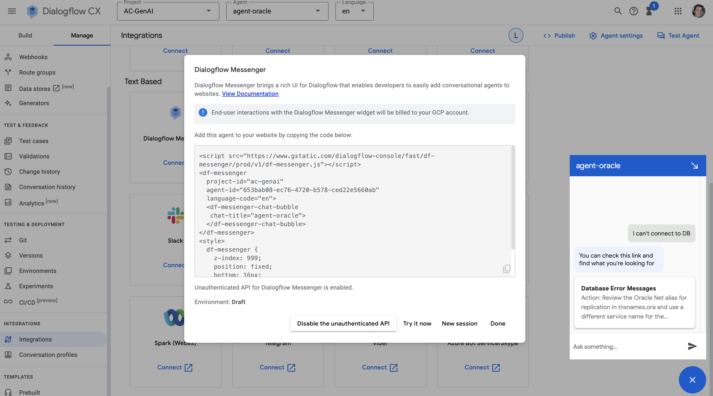
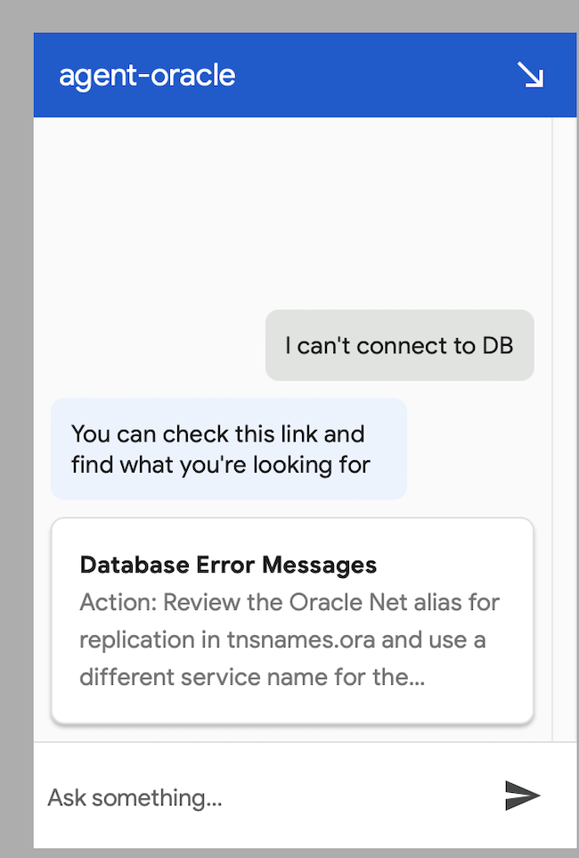

AI Hackathon (25th Nov)

- **Problem**: “Analyze Support Cases”
- **Use Case:** In summary, it suggests solutions for Oracle Database (19c version) issues based on the known issues is a smart strategy to optimize technical support, improve team efficiency, and provide a more satisfactory customer experience.

Members

- [Lineu Filho](mailto:lineu.filho@avenuecode.com)
- [Luiz Consani](mailto:luiz.consani@avenuecode.com)

Solution

Within Vertex AI, it is possible to create a Chat-type application, and this application resides within a set of applications called Search and Conversation.

This Search and Conversation application needs to access data in some way, whether it's through JSON, HTML, CSV, or other formats. To do this, we will place our database into a Cloud Storage and create a bucket to store the PDF containing all the problems and solutions related to Oracle database, as shown in the images below.

With the bucket properly configured, we can now create our application.

It should point to the data source, Data Store, which will be verified within Vertex AI so that the chat can respond to user questions regarding their database-related queries. The application can have as many Data Stores as necessary.

With the Data Store correctly linked to our application, we can now verify that everything is set up correctly and start asking questions to our chat. In the configuration tab, note that our model is already trained to answer questions, as shown in the image below.

In the Manage tab on the left corner, we can go to Integrations and create any type of integration we desire, including Google Chat, for example. In our application, we will create one based on DialogFlow Message.

DialogFlow allows us to create our chatbot on an HTML page, providing us with the necessary tags to be added to our page. With this code, you can see, by clicking "Try it now," the chat button in the lower right corner. You can use it to test if everything is working as planned.

In summary:

We used a Search and Conversation application to create the chat in which users could search for their various questions regarding problems using the Oracle database. The application was trained using a bucket that contains a file with the mapping of problems and solutions. After training, we created a chatbot-linked page with the application where we can ask different questions and obtain accurate answers according to what was trained, as shown in the images below.

Technologies

- GCP
- Vertex AI
- Cloud Storage
- Search and Conversation Application

Dataset Used

Used known issues for Oracle Database [https://docs.oracle.com/en/database/oracle/oracle-database/19/errmg/database-error-messages .pdf](https://docs.oracle.com/en/database/oracle/oracle-database/19/errmg/database-error-messages.pdf)

How it Works

- Access Website
- Click in the Help icon below:

- Then Support team can describe the issue reported related to “Oracle Database 19c”:

○ Ex 1: User described a scenario or issue without error code

- Ex 2: User reported specific error message
- 
